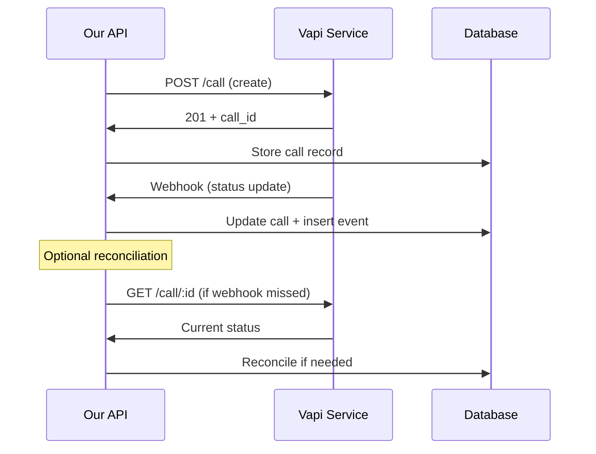
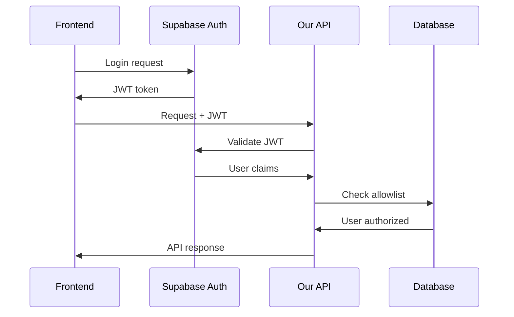

# AutoLynx Architecture — API Design

> **Complete API Specification & Integration Points**  
> **Related:** [System Overview](./system-overview.md) | [Data Architecture](./data-architecture.md) | [Assistant Management](./assistant-management.md)

---

## API Overview

All APIs are internal to the Next.js application. Authentication via Supabase Auth JWT tokens except for webhooks (shared secret) and cron (separate secret).

### API Categories
- **Assistant Management**: CRUD operations for the Assistant Directory
- **Campaign Management**: Campaign creation, control, and monitoring
- **Webhook Handlers**: External provider event processing
- **Read Models**: Optimized endpoints for UI consumption

---

## Assistant Management APIs

### List Assistants
**`GET /api/assistants`**

**Query Parameters:**
- `q?`: Name contains filter
- `active?`: Filter by active status
- `page?`: Pagination (default 1)
- `limit?`: Items per page (default 50, max 100)

**Response:**
```json
{
  "assistants": [
    {
      "id": "uuid",
      "provider_assistant_id": "vapi_assistant_id",
      "name": "Cold Call Assistant",
      "source": "local|imported|template",
      "active": true,
      "ephemeral": false,
      "created_at": "2024-01-01T12:00:00Z",
      "updated_at": "2024-01-01T12:00:00Z"
    }
  ],
  "pagination": {
    "page": 1,
    "limit": 50,
    "total": 25,
    "pages": 1
  }
}
```

### Create Local Assistant
**`POST /api/assistants`**

**Request:**
```json
{
  "name": "string",
  "config": {
    "model": "gpt-4",
    "voice": {
      "provider": "11labs",
      "voiceId": "string"
    },
    "systemPrompt": "string",
    "firstMessage": "string",
    "options": {
      "endCallMessage": "string",
      "recordingEnabled": true
    }
  }
}
```

**Behavior:**
1. Call Vapi `POST /assistant` with config
2. Store `provider_assistant_id` and `config_json` in DB
3. Return assistant record

**Response:**
```json
{
  "id": "uuid",
  "provider_assistant_id": "vapi_assistant_id",
  "name": "string",
  "source": "local",
  "config_json": "object",
  "active": true,
  "ephemeral": false
}
```

### Import External Assistant
**`POST /api/assistants/import`**

**Request:**
```json
{
  "providerAssistantId": "existing_vapi_id",
  "name": "Optional display name"
}
```

**Behavior:**
1. Validate assistant exists on Vapi via `GET /assistant/:id`
2. Upsert into `assistants` table with `source='imported'`
3. Store retrieved config as `config_json`

### Update Assistant
**`PATCH /api/assistants/[id]`**

**Request (partial):**
```json
{
  "name": "string?",
  "config": "object?",
  "active": "boolean?"
}
```

**Behavior:**
1. If `config` changed: PATCH Vapi assistant
2. Update local DB record
3. Set `updated_at` timestamp

### Delete Assistant
**`DELETE /api/assistants/[id]`**

**Validation:**
- Only allowed if **no active campaigns** reference it
- Check campaigns with status IN ('QUEUED', 'DIALING', 'RUNNING')

**Response:**
- `204 No Content`: Successfully deleted
- `409 Conflict`: Assistant in use by active campaigns

---

## Campaign Management APIs

### Create Campaign
**`POST /api/campaigns`**

**Request Format:** `multipart/form-data`
- `contactsCsv`: File upload (CSV)
- JSON fields:
  ```json
  {
    "name": "Campaign Name (optional)",
    "cap": 8,
    "mode": "continuous|batch",
    "assistantId": "uuid",
    "phoneNumberId": "vapi_phone_number_id"
  }
  ```

**Validation:**
- Assistant exists and is active
- Phone number ID is valid
- CSV has required headers: `name`, `business_name`, `phone`

**Response:**
```json
{
  "campaignId": "uuid",
  "importReport": {
    "totalRows": 150,
    "accepted": 145,
    "skipped": [
      {
        "row": 23,
        "reason": "Invalid phone number format",
        "data": {"name": "John", "phone": "invalid"}
      }
    ]
  },
  "campaign": {
    "id": "uuid",
    "name": "Campaign Name",
    "totalContacts": 145,
    "createdAt": "2024-01-01T12:00:00Z",
    "cap": 8,
    "mode": "continuous"
  }
}
```

### Start Campaign
**`POST /api/campaigns/[id]/start`**

**Request:**
```json
{
  "holdForConfirmation": false
}
```

**Behavior:**
1. Update campaign status to `QUEUED`
2. Optionally hold up to 30s to detect first successful call creation
3. Return estimated start time based on cron schedule

**Response:**
```json
{
  "status": "QUEUED",
  "estimatedStartTime": "2024-01-01T12:01:00Z",
  "message": "Campaign queued for next scheduler tick"
}
```

---

## Scheduler & Webhook APIs

### Scheduler Tick (Cron Entry Point)
**`POST /api/scheduler/tick`**

**Authentication:** Bearer token with `CRON_SHARED_SECRET`

**Request:**
```json
{
  "campaignId": "uuid?" // Optional - processes all if omitted
}
```

**Behavior:**
1. Query campaigns with status `QUEUED` or `RUNNING`
2. For each campaign, calculate available room under cap
3. Launch calls for eligible contacts
4. Update campaign status if first calls launched

**Response:**
```json
{
  "processed": {
    "campaigns": 3,
    "callsLaunched": 12,
    "callsActive": 18,
    "callsQueued": 5
  },
  "details": [
    {
      "campaignId": "uuid",
      "launched": 4,
      "active": 6,
      "cap": 8,
      "status": "RUNNING"
    }
  ]
}
```

### Vapi Webhook Handler
**`POST /api/webhooks/vapi`**

**Authentication:** HMAC signature verification
- Header: `X-Signature` or `X-Vapi-Signature`
- Verify against `WEBHOOK_SHARED_SECRET`

**Request (Vapi Call Status Event):**
```json
{
  "type": "call-status",
  "call": {
    "id": "provider_call_id",
    "status": "in-progress|ended|failed",
    "customer": {
      "number": "+1234567890"
    },
    "endedReason": "customer-hangup",
    "cost": 0.05,
    "duration": 45.2,
    "recordingUrl": "https://recordings.vapi.ai/...",
    "transcript": {
      "messages": [
        {
          "role": "assistant",
          "message": "Hello, this is...",
          "timestamp": "2024-01-01T12:00:00Z"
        }
      ]
    },
    "analysis": {
      "summary": "Customer was interested but busy",
      "successEvaluation": true
    }
  }
}
```

**Behavior:**
1. Verify webhook signature
2. Look up call by `provider_call_id`
3. Insert immutable `call_events` record
4. Update `calls` table with new status and data
5. Check if campaign is complete

**Response:**
```json
{
  "received": true,
  "callId": "internal_uuid",
  "status": "updated"
}
```

---

## Read Model APIs

### Campaign List
**`GET /api/campaigns`**

**Query Parameters:**
- `status?`: Filter by campaign status
- `page?`, `limit?`: Pagination
- `search?`: Search by campaign name

**Response:**
```json
{
  "campaigns": [
    {
      "id": "uuid",
      "name": "Q1 Outreach",
      "status": "RUNNING",
      "assistant": {
        "id": "uuid",
        "name": "Sales Assistant"
      },
      "metrics": {
        "totalContacts": 200,
        "completedCalls": 45,
        "activeCalls": 3,
        "successfulCalls": 12,
        "totalCost": 15.75
      },
      "createdAt": "2024-01-01T12:00:00Z",
      "startedAt": "2024-01-01T12:05:00Z"
    }
  ]
}
```

### Campaign Detail
**`GET /api/campaigns/[id]`**

**Response:**
```json
{
  "id": "uuid",
  "name": "Q1 Outreach",
  "status": "RUNNING",
  "mode": "continuous",
  "cap": 8,
  "assistant": {
    "id": "uuid",
    "name": "Sales Assistant",
    "config": "object"
  },
  "phoneNumberId": "vapi_phone_number_id",
  "metrics": {
    "totalContacts": 200,
    "callsByStatus": {
      "ENDED": 42,
      "IN_PROGRESS": 3,
      "FAILED": 5
    },
    "successRate": 0.24,
    "averageCost": 0.35,
    "averageDuration": 67.5,
    "totalCost": 15.75
  },
  "timeline": {
    "createdAt": "2024-01-01T12:00:00Z",
    "startedAt": "2024-01-01T12:05:00Z",
    "estimatedCompletion": "2024-01-01T15:30:00Z"
  }
}
```

### Campaign Contacts & Calls
**`GET /api/campaigns/[id]/contacts`**

**Query Parameters:**
- `page?`, `limit?`: Pagination (default 50, max 500)
- `status?`: Filter by call status
- `search?`: Search by name/business/phone
- `batch?`: Filter by batch_index (batch mode only)

**Response:**
```json
{
  "contacts": [
    {
      "id": "uuid",
      "name": "John Doe",
      "businessName": "Acme Corp",
      "phone": "+1234567890",
      "batchIndex": 0,
      "call": {
        "id": "uuid",
        "status": "ENDED",
        "startedAt": "2024-01-01T12:10:00Z",
        "endedAt": "2024-01-01T12:11:30Z",
        "endedReason": "customer-hangup",
        "cost": 0.05,
        "recordingUrl": "https://...",
        "successEvaluation": true,
        "duration": 90
      }
    }
  ],
  "pagination": {
    "page": 1,
    "limit": 50,
    "total": 200,
    "pages": 4
  },
  "summary": {
    "contactsShown": 50,
    "callsCompleted": 35,
    "callsActive": 2,
    "callsPending": 13
  }
}
```

### Export Campaign Data
**`GET /api/campaigns/[id]/export.csv`**

**Response:** Streaming CSV with headers: 
```
name,business_name,phone,call_status,ended_reason,cost_usd,duration_seconds,recording_url,success_evaluation,transcript_summary
```

**Implementation:** Stream large datasets without loading into memory.

### Phone Line Health Check
**`GET /api/health/phone-line`**

**Query Parameters:**
- `campaignId?`: Specific campaign context
- `phoneNumberId?`: Direct phone number query

**Response:**
```json
{
  "phoneNumberId": "vapi_phone_number_id",
  "activeCalls": 3,
  "lastChecked": "2024-01-01T12:15:00Z",
  "status": "healthy|busy|error",
  "provider": "vapi"
}
```

**Note:** This is for **informational purposes only** - never used for batch gating logic.

---

## Error Handling & Standards

### Standard Error Response Format
```json
{
  "error": {
    "code": "VALIDATION_ERROR",
    "message": "Invalid phone number format",
    "details": {
      "field": "phone",
      "value": "123-invalid",
      "expected": "E.164 format (+1234567890)"
    },
    "timestamp": "2024-01-01T12:00:00Z"
  }
}
```

### HTTP Status Codes
- **200**: Success with data
- **201**: Created successfully  
- **204**: Success, no content
- **400**: Bad request / validation error
- **401**: Unauthorized (missing/invalid auth)
- **403**: Forbidden (insufficient permissions)
- **404**: Resource not found
- **409**: Conflict (e.g., assistant in use)
- **429**: Rate limited
- **500**: Internal server error

### Rate Limiting
- **General endpoints**: 100 requests/minute per user
- **Upload endpoints**: 10 requests/minute per user
- **Export endpoints**: 5 requests/minute per user
- **Webhook endpoints**: No rate limiting (external source)

### Retry Logic
- **Exponential backoff**: 1s → 4s → 10s for Vapi API calls
- **Circuit breaker**: Disable calls after consecutive failures
- **Idempotency**: Safe retry for all non-mutating operations

---

## Integration Patterns

### Vapi Integration Flow


### Authentication Flow

```
