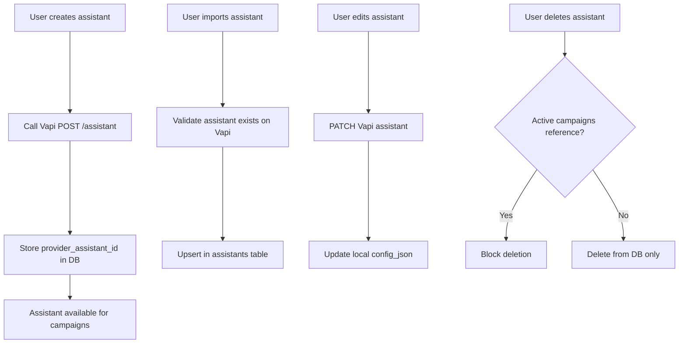
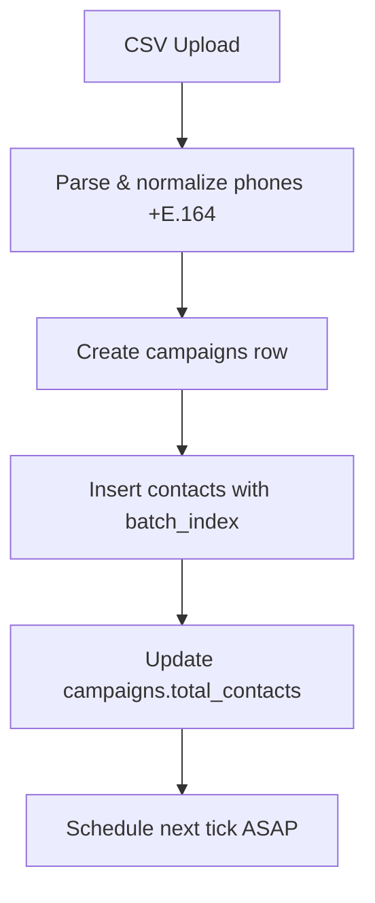
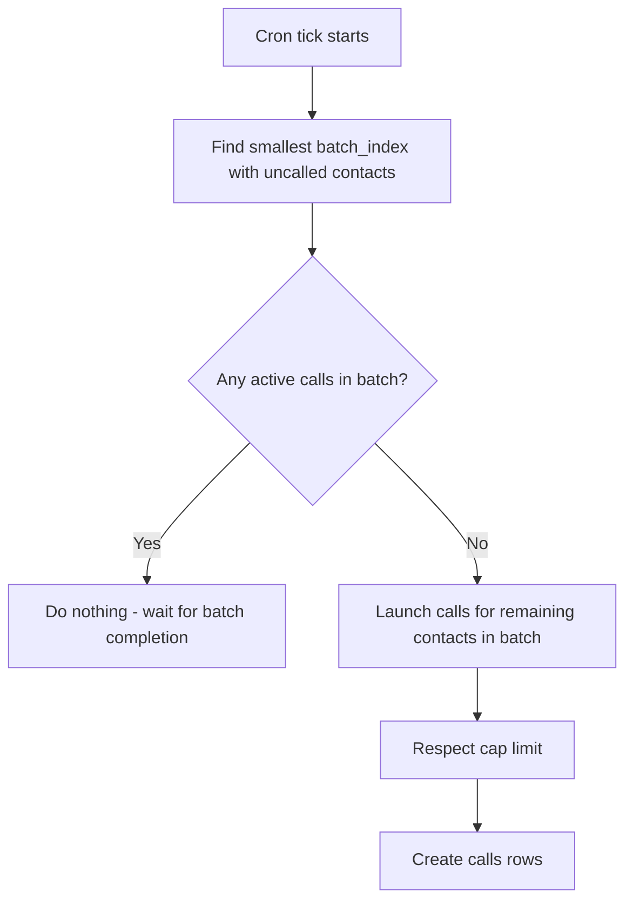
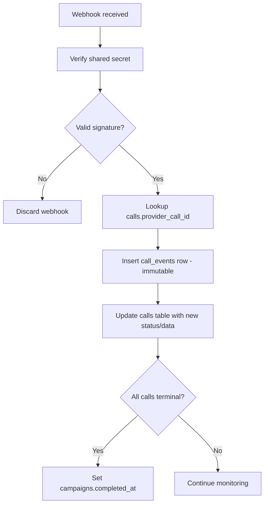
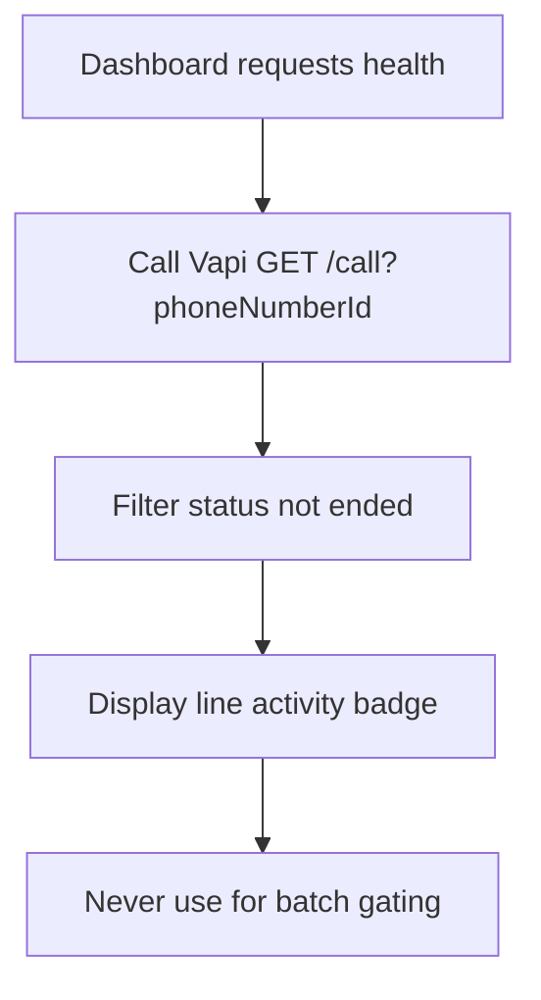
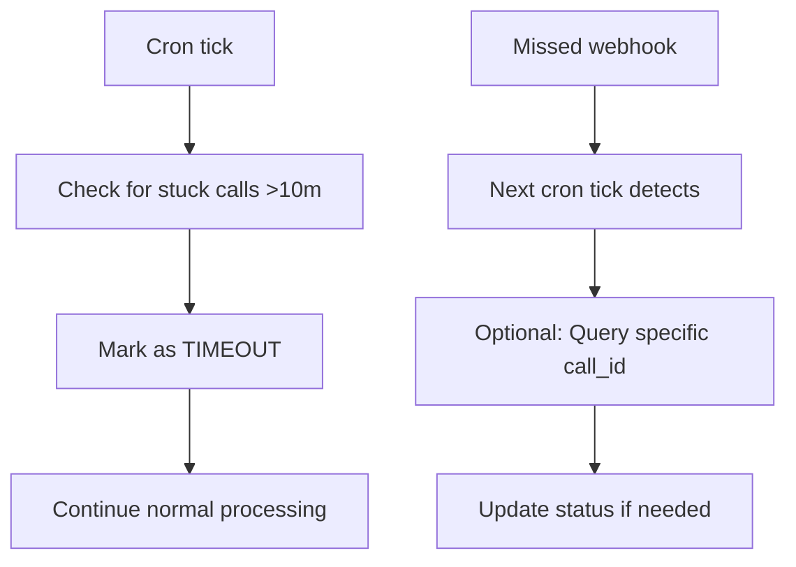
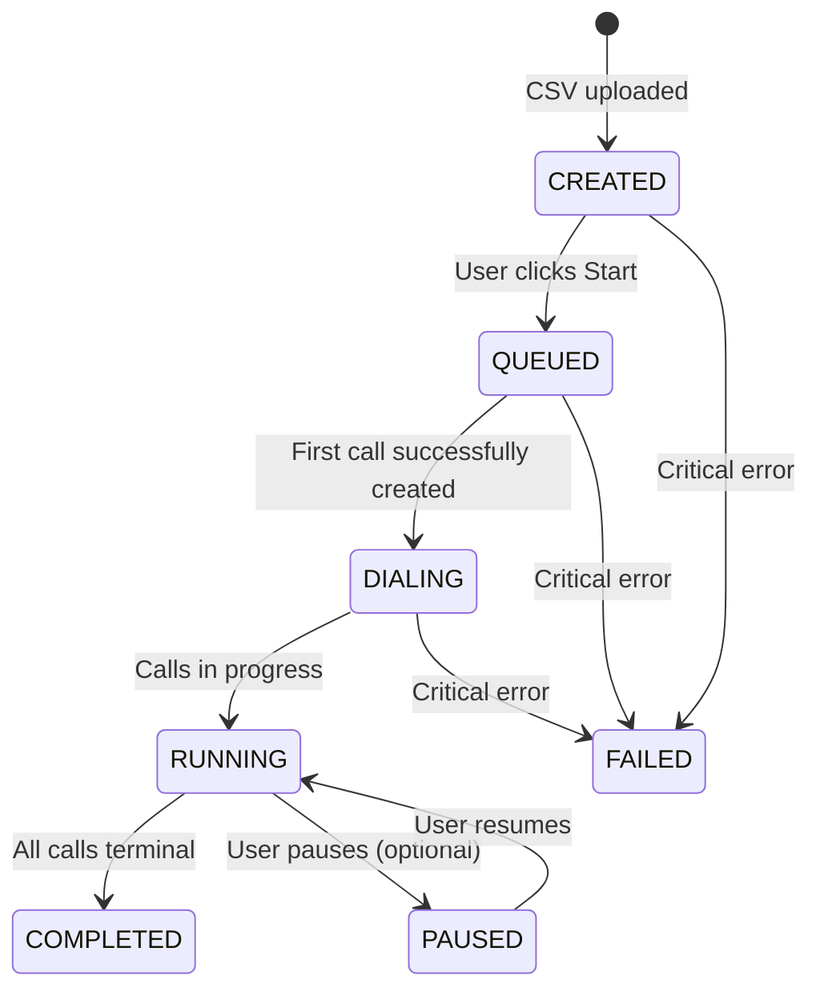

# AutoLynx Architecture — Concurrency & Flows

> **Campaign Management & Call Flow Orchestration**  
> **Related:** [System Overview](./system-overview.md) | [API Design](./api-design.md) | [Data Architecture](./data-architecture.md)

---

## Concurrency Model & Batch Semantics

Two modes (user selects per campaign):

- **Mode A – Continuous Cap (default)**: Keep `active_calls ≤ cap`. Each tick fills available room.
- **Mode B – Strict Batching (optional)**: Contacts partitioned into batches of `cap` size. Only start batch *N+1* when all calls in batch *N* are terminal (based on our DB, not external queries).

### Definitions

- **Active call**: status in `{QUEUED, RINGING, IN_PROGRESS}`
- **Terminal**: status in `{ENDED, FAILED, CANCELED, TIMEOUT}`
- **Campaign Started**: first successful 2xx from `POST /call` recorded
- **Campaign Completed**: zero active calls **and** at least one call exists for the campaign

### Stuck Handling
If a call receives no event for >10m, mark `TIMEOUT` and proceed.

---

## Gating Strategy (Configurable)

### Default (Recommended): Call‑ID Truth
Batches advance when all calls we created for the batch are terminal **according to our DB** (fed by Vapi webhooks). This is precise and light on Vapi APIs.

### Optional (Advanced): Line‑Quiet Gating
Also require `activeCalls(phoneNumberId) == 0` before starting the next batch. This mirrors your n8n approach. It is disabled by default because it's coarser and can be affected by unrelated calls, but it's available as a toggle per campaign if you want it.

---

## Cron Cadence

### What It Is & Defaults

- **Cron cadence** means **how often the scheduler tick runs** to launch new calls (e.g., every 60s)
- **Default**: **every 60 seconds**, with a tiny in‑code jitter (±10%) to avoid thundering herd
- **Why 60s**: keeps the system responsive without hammering the provider; combined with the cap, it bounds how many create‑call requests we can produce
- **Rate‑limit safety**: With `cap=8`, worst‑case we post up to 8 new calls per minute per campaign; the cap ensures we don't exceed concurrency even if webhooks are slow

---

## Monitoring Strategies

We keep both approaches for different purposes:

### Primary: Call‑ID Tracking
We persist provider `call_id` on creation and accept authoritative updates from webhooks. Optional per‑call reconcile (backoff) if a webhook is missed.

**Rationale**: Precise tracking with low API load.

### Fallback/Health: Phone Number Polling
Occasional `GET /call?phoneNumberId=...` to show "line active" count on the dashboard. **Never used to gate batches.**

**Rationale**: Quick, coarse health signals for operational awareness.

---

## Key Flows (Step‑by‑Step)

### Assistant Lifecycle (Pre‑Campaign)



1. **Create** in app → we call Vapi `POST /assistant` with `config_json`; store `provider_assistant_id` in `assistants`
2. **Import** from Vapi → user pastes `provider_assistant_id`; we validate it exists, then upsert in `assistants`
3. **Edit** → PATCH both our DB `config_json` and Vapi assistant
4. **Delete (manual)** → only allowed if no active campaigns reference it. **No auto‑deletion** during call flows

### CSV Upload → Campaign Create



1. Parse CSV; normalize phones (`+E.164`)
2. Create `campaigns` row with `cap`, `mode`, `phone_number_id`, `assistant_id`
3. Insert `contacts` (assign `batch_index` if `mode=batch`)
4. Update `campaigns.total_contacts`
5. Schedule next **tick** ASAP (store a timestamp or just rely on Cron cadence)

### Scheduler Tick (Mode A: Continuous Cap)

```mermaid
graph TD
    A[Cron tick starts] --> B[Count active calls for campaign]
    B --> C[Calculate room = max(0, cap - active)]
    C --> D[Select next 'room' contacts without calls]
    D --> E[For each contact: resolve assistant_id]
    E --> F[POST /call to Vapi]
    F --> G[Create calls row with provider_call_id]
    G --> H{First call launched?}
    H -->|Yes| I[Set campaigns.started_at]
    H -->|No| J[Continue processing]
```

1. `active = count(calls where status in active for campaign)`
2. `room = max(0, cap - active)`
3. Select next `room` contacts that don't yet have a call
4. For each contact: use the campaign's `assistant_id` → resolve to `assistants.provider_assistant_id` → `POST /call` → create `calls` row with `provider_call_id` and `QUEUED`; set `started_at`
5. If first launched → set `campaigns.started_at`

### Scheduler Tick (Mode B: Strict Batching)



1. Determine smallest `batch_index` with outstanding contacts not yet called
2. If any call in that batch is active → do nothing
3. Else launch calls for remaining contacts in that batch (up to cap)

### Webhook Handling



1. Verify secret; discard if invalid
2. Look up `calls.provider_call_id`
3. Insert `call_events` (immutable), update `calls` with mapped status, costs, transcript, URLs
4. If `no active calls remain` and `≥1 call exists` → set `campaigns.completed_at`

### Fallback Health Check (Phone Number)



UI calls a thin API that queries Vapi `listCalls(phoneNumberId, status not ended)` occasionally (e.g., 60–120s) for a **line activity badge**. Informational only.

---

## Error Handling, Retries & Timeouts

### Call Creation Errors
- **Create call**: on non‑2xx, retry with exponential backoff (cap at 3 tries, 1s→4s→10s). If still failing, record a `FAILED` call row
- **Rate limits**: bounded by `cap` and tick cadence; optional jitter (±10%) on cron to avoid bursts

### Webhook Reliability
- **Webhook gaps**: if a call has no event for 10m, mark `TIMEOUT`
- **Cron idempotency**: launching selects contacts **without** existing `calls` row; safe on retries

### State Reconciliation



---

## Campaign State Machine

### States & Transitions



### State Definitions
- **CREATED**: Campaign exists, contacts loaded, not started
- **QUEUED**: Start button clicked, waiting for first cron tick
- **DIALING**: First successful call created (truthful start)
- **RUNNING**: Calls active, more may be launched
- **COMPLETED**: All contacts processed, no active calls
- **PAUSED**: User-initiated pause (optional feature)
- **FAILED**: Unrecoverable error state

---

## Performance & Scaling Considerations

### Bottlenecks & Mitigations
- **Database queries**: Optimized indexes on campaign_id, status
- **API rate limits**: Respect provider limits with jitter
- **Webhook processing**: Async handling with queuing for high volume

### Monitoring Metrics
- **Calls per minute**: Track creation rate vs limits
- **Webhook latency**: Monitor delay between call events
- **Stuck call rate**: Percentage requiring timeout handling
- **Campaign completion time**: End-to-end performance tracking

### Scaling Strategies
- **Horizontal scaling**: Vercel functions auto-scale
- **Database optimization**: Connection pooling and read replicas
- **Cron distribution**: Multiple cron jobs for high-volume campaigns
- **Webhook queuing**: Message queue for high-throughput webhook processing 