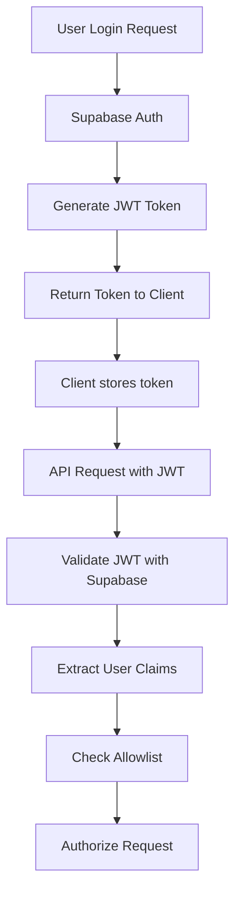
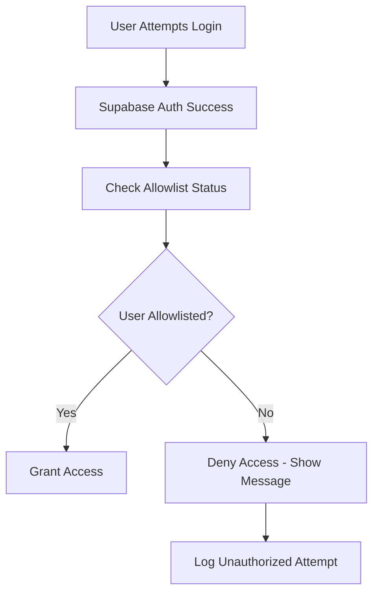
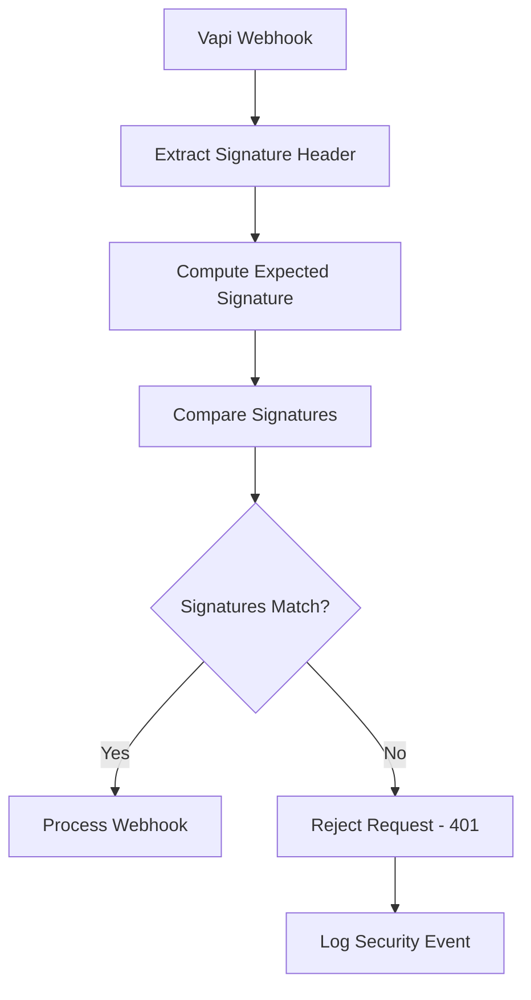

# AutoLynx Architecture — Security & Authentication

> **Authentication, Authorization & Security Measures**  
> **Related:** [System Overview](./system-overview.md) | [API Design](./api-design.md) | [Deployment & Operations](./deployment-ops.md)

---

## Authentication Architecture

### Supabase Auth Integration



#### Authentication Flow
1. **Login Methods**: Magic link, OAuth (Google, GitHub), email/password
2. **JWT Generation**: Supabase generates signed JWT with user claims
3. **Token Storage**: Client stores JWT in secure HTTP-only cookies
4. **Request Authentication**: All API requests include JWT in Authorization header
5. **Server Validation**: Server validates JWT signature and expiration with Supabase

#### JWT Token Structure
```json
{
  "sub": "user-uuid",
  "email": "user@example.com", 
  "role": "authenticated",
  "aud": "authenticated",
  "iat": 1642000000,
  "exp": 1642086400,
  "app_metadata": {
    "provider": "email",
    "allowlisted": true
  },
  "user_metadata": {
    "name": "John Doe"
  }
}
```

### Session Management
- **Session Duration**: 24 hours default, refreshed automatically
- **Refresh Tokens**: Secure refresh token rotation
- **Session Storage**: HTTP-only cookies for web, secure storage for mobile
- **Multi-Device**: Support for multiple concurrent sessions

---

## Authorization & Access Control

### User Roles & Permissions

#### Role Definitions
- **Admin**: Full system access, user management, assistant management, all campaigns
- **Operator**: Campaign creation and management, assistant usage, own data only

#### Permission Matrix
| Resource | Admin | Operator |
|----------|-------|----------|
| User Management | Full | None |
| Assistant Management | Full | Read + Use |
| Campaign Management | Full | Own Only |
| System Settings | Full | Read Only |
| Analytics | Full | Own Data |
| Export Data | Full | Own Campaigns |

### Allowlist Management



#### Allowlist Implementation
```sql
-- User profiles with allowlist status
CREATE TABLE user_profiles (
  id UUID PRIMARY KEY REFERENCES auth.users(id),
  role TEXT NOT NULL DEFAULT 'operator' CHECK (role IN ('admin', 'operator')),
  allowlisted BOOLEAN NOT NULL DEFAULT false,
  created_at TIMESTAMPTZ NOT NULL DEFAULT now(),
  last_seen_at TIMESTAMPTZ
);

-- Allowlist check function
CREATE OR REPLACE FUNCTION check_user_allowlist(user_id UUID)
RETURNS BOOLEAN AS $$
BEGIN
  RETURN EXISTS (
    SELECT 1 FROM user_profiles 
    WHERE id = user_id AND allowlisted = true
  );
END;
$$ LANGUAGE plpgsql SECURITY DEFINER;
```

#### Allowlist Management Process
1. **Admin Registration**: Admins can add users to allowlist
2. **Email Validation**: Verify email before allowlist addition
3. **Role Assignment**: Set default role during allowlist addition
4. **Access Revocation**: Remove from allowlist to revoke access
5. **Audit Trail**: Log all allowlist changes

### Route Protection

#### Middleware Implementation
```typescript
// middleware.ts
export async function middleware(request: NextRequest) {
  const token = request.cookies.get('supabase-auth-token');
  
  if (!token) {
    return NextResponse.redirect('/login');
  }
  
  const { user, error } = await supabase.auth.getUser(token.value);
  
  if (error || !user) {
    return NextResponse.redirect('/login');
  }
  
  // Check allowlist status
  const isAllowlisted = await checkUserAllowlist(user.id);
  
  if (!isAllowlisted) {
    return NextResponse.redirect('/unauthorized');
  }
  
  return NextResponse.next();
}
```

#### Protected Routes
- `/dashboard/*`: Require authentication + allowlist
- `/api/*`: Require authentication + allowlist (except webhooks)
- `/admin/*`: Require authentication + allowlist + admin role
- `/public/*`: Public access (landing pages, docs)

---

## API Security

### Webhook Security



#### HMAC Signature Verification
```typescript
function verifyWebhookSignature(
  payload: string,
  signature: string,
  secret: string
): boolean {
  const expectedSignature = crypto
    .createHmac('sha256', secret)
    .update(payload)
    .digest('hex');
    
  const providedSignature = signature.replace('sha256=', '');
  
  return crypto.timingSafeEqual(
    Buffer.from(expectedSignature, 'hex'),
    Buffer.from(providedSignature, 'hex')
  );
}
```

#### Webhook Security Measures
- **Shared Secret**: Verify webhook authenticity with HMAC-SHA256
- **Timing Attack Protection**: Use `crypto.timingSafeEqual` for comparison
- **Replay Protection**: Optional timestamp validation within time window
- **Rate Limiting**: Prevent webhook flooding attacks
- **Origin Validation**: Verify requests come from Vapi IP ranges

### Cron Job Security

#### Authentication
```typescript
// /api/scheduler/tick
export async function POST(request: Request) {
  const authHeader = request.headers.get('authorization');
  const expectedAuth = `Bearer ${process.env.CRON_SHARED_SECRET}`;
  
  if (authHeader !== expectedAuth) {
    return new Response('Unauthorized', { status: 401 });
  }
  
  // Process cron job
}
```

#### Security Measures
- **Shared Secret**: Verify cron requests with bearer token
- **Source Validation**: Ensure requests come from Vercel cron infrastructure
- **Idempotency**: Safe to retry without side effects
- **Timeout Protection**: Limit execution time to prevent hangs

### API Rate Limiting

#### Rate Limiting Strategy
```typescript
const rateLimits = {
  general: { requests: 100, window: 60 }, // 100/minute
  upload: { requests: 10, window: 60 },   // 10/minute  
  export: { requests: 5, window: 60 },    // 5/minute
  webhook: { requests: 1000, window: 60 } // 1000/minute
};
```

#### Implementation
- **User-Based Limits**: Track requests per authenticated user
- **IP-Based Fallback**: Rate limit by IP for unauthenticated requests
- **Sliding Window**: Use Redis/memory store for rate limit tracking
- **Graceful Degradation**: Return 429 with retry-after header

---

## Data Security

### Encryption

#### Data at Rest
- **Database Encryption**: Supabase provides AES-256 encryption at rest
- **Transcript Storage**: JSONB fields encrypted with database encryption
- **Backup Encryption**: Automated backups encrypted with separate keys
- **Secret Storage**: Environment variables encrypted by Vercel/Supabase

#### Data in Transit
- **TLS 1.3**: All API communications over HTTPS
- **Certificate Validation**: Strict certificate validation for external APIs
- **Webhook HTTPS**: Require HTTPS for all webhook endpoints
- **Database Connections**: Encrypted connections to Supabase

### PII Handling

#### Data Minimization
```sql
-- Minimal PII storage
CREATE TABLE contacts (
  id UUID PRIMARY KEY,
  name TEXT NOT NULL,           -- Required for calls
  business_name TEXT,           -- Business context
  phone TEXT NOT NULL,          -- Required for calls
  -- NO: address, SSN, financial data
);
```

#### PII Protection Measures
- **Limited Storage**: Store only essential PII for call functionality
- **Encryption**: All PII encrypted at rest via database encryption
- **Access Logging**: Log all access to PII data
- **Retention Policies**: Automatic deletion after retention period
- **Anonymization**: Option to anonymize completed campaigns

#### Transcript Sanitization
```typescript
function sanitizeTranscript(transcript: any): any {
  // Remove/redact common PII patterns
  const piiPatterns = [
    /\b\d{3}-\d{2}-\d{4}\b/g,        // SSN
    /\b\d{4}\s?\d{4}\s?\d{4}\s?\d{4}\b/g, // Credit cards
    /\b[A-Za-z0-9._%+-]+@[A-Za-z0-9.-]+\.[A-Z|a-z]{2,}\b/g // Emails
  ];
  
  let sanitized = JSON.stringify(transcript);
  piiPatterns.forEach(pattern => {
    sanitized = sanitized.replace(pattern, '[REDACTED]');
  });
  
  return JSON.parse(sanitized);
}
```

### Access Control

#### Database Security
- **Service Role Key**: Use Supabase service role key only in server routes
- **Anon Key**: Use anon key only for client-side auth operations
- **Connection Limits**: Limit database connections per application
- **Query Logging**: Log all database queries for audit

#### Row Level Security (Future)
```sql
-- Multi-tenant RLS policies
ALTER TABLE campaigns ENABLE ROW LEVEL SECURITY;

CREATE POLICY campaigns_org_isolation ON campaigns
  USING (org_id = (auth.jwt() ->> 'org_id')::uuid);

CREATE POLICY campaigns_user_access ON campaigns  
  USING (
    org_id = (auth.jwt() ->> 'org_id')::uuid
    AND (
      (auth.jwt() ->> 'role') = 'admin'
      OR created_by = auth.uid()
    )
  );
```

---

## Security Monitoring

### Audit Logging

#### Security Events
```typescript
interface SecurityEvent {
  event_type: 'auth_success' | 'auth_failure' | 'access_denied' | 'data_access';
  user_id?: string;
  ip_address: string;
  user_agent: string;
  resource: string;
  timestamp: Date;
  metadata: Record<string, any>;
}
```

#### Logged Events
- **Authentication**: Login attempts, failures, token refresh
- **Authorization**: Access denials, role escalations
- **Data Access**: PII access, export operations, admin actions
- **Security**: Webhook signature failures, rate limit violations

### Threat Detection

#### Anomaly Detection
- **Failed Login Attempts**: Multiple failures from same IP/user
- **Unusual Access Patterns**: Access outside normal hours/locations
- **Data Export Volume**: Unusual export activity
- **API Abuse**: Unusual request patterns or volumes

#### Response Procedures
1. **Automated Blocking**: Temporary IP/user blocking for clear attacks
2. **Alert Generation**: Notify admins of security events
3. **Investigation**: Manual review of suspicious activity
4. **Account Lockdown**: Disable compromised accounts immediately

### Compliance & Privacy

#### Privacy Regulations
- **GDPR Compliance**: Right to deletion, data portability, consent
- **CCPA Compliance**: Data disclosure, deletion rights
- **TCPA Compliance**: Call consent and opt-out mechanisms
- **SOC 2**: Security controls and audit procedures

#### Data Retention
```sql
-- Automated data retention policies
CREATE OR REPLACE FUNCTION cleanup_old_data() 
RETURNS void AS $$
BEGIN
  -- Delete completed campaigns older than 2 years
  DELETE FROM campaigns 
  WHERE completed_at < NOW() - INTERVAL '2 years';
  
  -- Archive old call events (7 years for audit)
  INSERT INTO call_events_archive 
  SELECT * FROM call_events 
  WHERE created_at < NOW() - INTERVAL '7 years';
  
  DELETE FROM call_events 
  WHERE created_at < NOW() - INTERVAL '7 years';
END;
$$ LANGUAGE plpgsql;
```

#### Incident Response
1. **Detection**: Automated alerts and monitoring
2. **Assessment**: Determine scope and impact
3. **Containment**: Stop ongoing threats immediately
4. **Investigation**: Root cause analysis and evidence collection
5. **Recovery**: Restore systems and implement fixes
6. **Lessons Learned**: Update procedures and controls

---

## Security Best Practices

### Development Security
- **Code Review**: All security-related code reviewed by multiple developers
- **Dependency Scanning**: Regular security scans of npm packages
- **Secret Management**: No secrets in code, use environment variables
- **Input Validation**: Validate and sanitize all user inputs

### Infrastructure Security
- **Network Security**: Firewall rules and network segmentation
- **Access Control**: Principle of least privilege for all systems
- **Monitoring**: Comprehensive logging and alerting
- **Backup Security**: Encrypted backups with tested restore procedures

### Operational Security
- **Regular Updates**: Keep all dependencies and systems updated
- **Security Training**: Regular security training for all team members
- **Incident Drills**: Practice incident response procedures
- **Third-Party Risk**: Security assessment of all third-party services 