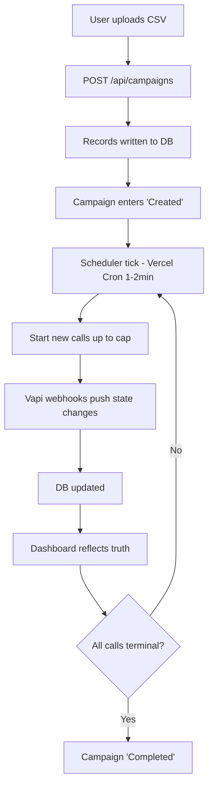
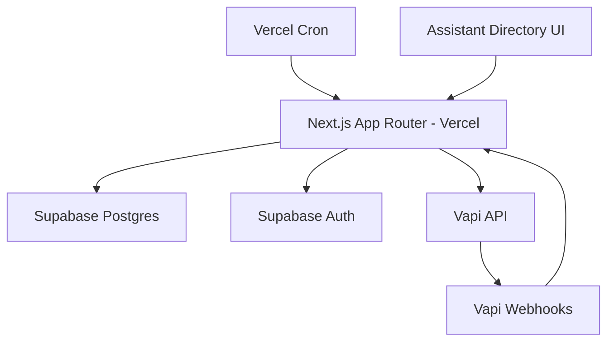
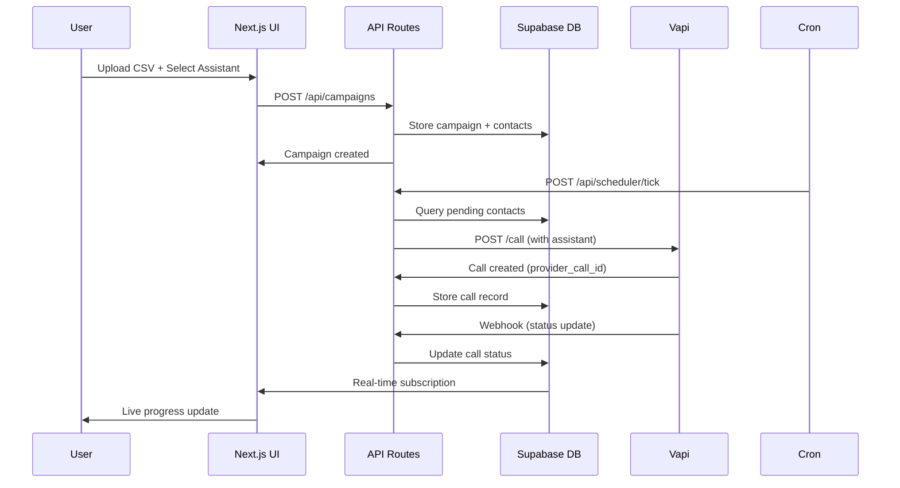

# AutoLynx Architecture — System Overview

> **Core Architecture & Design Principles**  
> **Related:** [Concurrency & Flows](./concurrency-flows.md) | [Data Architecture](./data-architecture.md) | [API Design](./api-design.md)

---

## Purpose & Summary

A simple, robust system to:

- Upload a CSV with `name, business_name, phone`
- Launch and control a cold‑calling campaign with a **global concurrency cap**
- Track every call precisely; show real‑time progress and outcomes
- Be cheap/easy to host on **Vercel (frontend+API)** and **Supabase (Postgres + Auth)**

### Design Pillars

- **Event‑driven truth** via **webhooks**; **no long background loops**
- **Call‑ID tracking (primary)** for correctness; **phoneNumber polling (fallback)** for health/ops
- **Keep complexity down**: short Vercel functions + cron ticks
- **Assistant persistence**: no auto-deletes, reuse across campaigns

### Non‑Goals
Live chat, advanced multi‑tenancy today.

---

## System Context

### Actors
- **Admin users** (allow‑listed)
- **Supabase DB** (Postgres + Auth)
- **Vapi** (telephony/assistant provider)
- **Vercel** (Next.js + Cron hosting)

### High‑Level Flow

1. User uploads CSV → `POST /api/campaigns` → records written to DB → campaign enters **Created**
2. **Scheduler tick** (Vercel Cron, 1–2 min): starts new calls up to the **cap**
3. Vapi **webhooks** push call state changes → DB updated → dashboard reflects truth
4. When all calls terminal → campaign **Completed**

---

## Component Architecture

### Core Components

- **Next.js App (App Router)** on Vercel: UI + API routes
- **Assistant Directory & UI**: create/import/manage persistent **Vapi assistants**; select one per campaign
- **Vercel Cron**: triggers `/api/scheduler/tick`
- **Supabase Postgres**: campaigns, contacts, calls, events, **assistants**; Supabase Auth
- **Vapi**: assistant + phone calls + webhooks

### Data Flow Architecture

---

## Assistant Directory Architecture

### Purpose
Replace ad‑hoc "Create Assistant"/"Delete Assistant" nodes with a **first‑class Assistant Directory**.

### Key Features

- **Persistent assistants**: Users create assistants inside our app (we call Vapi `POST /assistant` once and persist the returned `assistantId`). We **never auto‑delete** persistent assistants
- **Import existing**: Users can paste a Vapi **assistantId** to register an external assistant for reuse
- **Templates**: We seed 2–3 stock assistants (e.g., "Voicemail‑friendly", "Short Pitch", "Discovery") that users can clone and tweak
- **Selection per campaign**: `assistantId` is mandatory when creating a campaign; the campaign simply references a **registered assistant**
- **Optional ephemeral assistants**: Supported via a flag (`ephemeral=true`) for advanced cases; only these may be auto‑deleted after use. Default is **persistent=false → do not delete**
- **Versioning (lightweight)**: We store `config_json` (prompt/voice/model) in our DB. Editing an assistant updates `config_json` and also PATCHes the assistant on Vapi

### Why This Design

- Keeps creation/deletion **out** of the calling hot path
- Avoids accidental deletion of assistants used by active or future campaigns
- Makes campaign creation simple and deterministic: select one ID and go

---

## System Boundaries & Constraints

### Technical Constraints
- **Vercel Functions**: 10s execution limit for API routes
- **Supabase**: Connection limits based on plan
- **Vapi**: Rate limits and concurrent call limits (10 on free plan)

### Operational Constraints
- **Concurrency Cap**: Default 8 to stay under Vapi's 10 concurrent limit
- **Cron Frequency**: 60s to balance responsiveness vs API load
- **Webhook Reliability**: 10m timeout for stuck calls

### Security Boundaries
- **Authentication**: Supabase Auth with allow-list
- **Authorization**: Admin vs Operator roles
- **Data Isolation**: Single-tenant for v1, multi-tenant RLS for future

---

## Quality Attributes

### Performance
- **Responsiveness**: Real-time dashboard updates via DB subscriptions
- **Scalability**: Horizontal scaling via serverless functions
- **Efficiency**: Minimal API calls through smart caching and batching

### Reliability
- **Fault Tolerance**: Webhook reconciliation for missed events
- **Error Recovery**: Exponential backoff for API failures
- **Consistency**: Event-sourced call state with immutable audit log

### Security
- **Authentication**: JWT-based with Supabase Auth
- **Authorization**: Role-based access control
- **Privacy**: Minimal PII storage with transcript encryption

### Maintainability
- **Modularity**: Clear separation between UI, API, and data layers
- **Testability**: Isolated components with mocked external dependencies
- **Observability**: Comprehensive logging and metrics

---

## Architecture Evolution

### Current State (v1.0)
- Single-tenant with allow-list
- Inline transcript storage
- Basic assistant management
- Manual scaling

### Future Considerations
- **Multi-tenancy**: RLS policies with org_id
- **Advanced Analytics**: Separate analytics database
- **Microservices**: Extract heavy processing to dedicated services
- **CDN Integration**: Static asset optimization

---

## Risk Mitigation

### Provider Dependencies
- **Vapi Outages**: Graceful degradation with status notifications
- **Rate Limiting**: Respect limits with backoff and jitter
- **API Changes**: Version pinning and compatibility layers

### Data Integrity
- **Webhook Reliability**: Reconciliation on cron ticks
- **State Consistency**: Event sourcing with audit trails
- **Backup Strategy**: Automated Supabase backups

### Operational Risks
- **Resource Exhaustion**: Monitoring and alerting
- **Security Breaches**: Principle of least privilege
- **Performance Degradation**: Query optimization and caching 