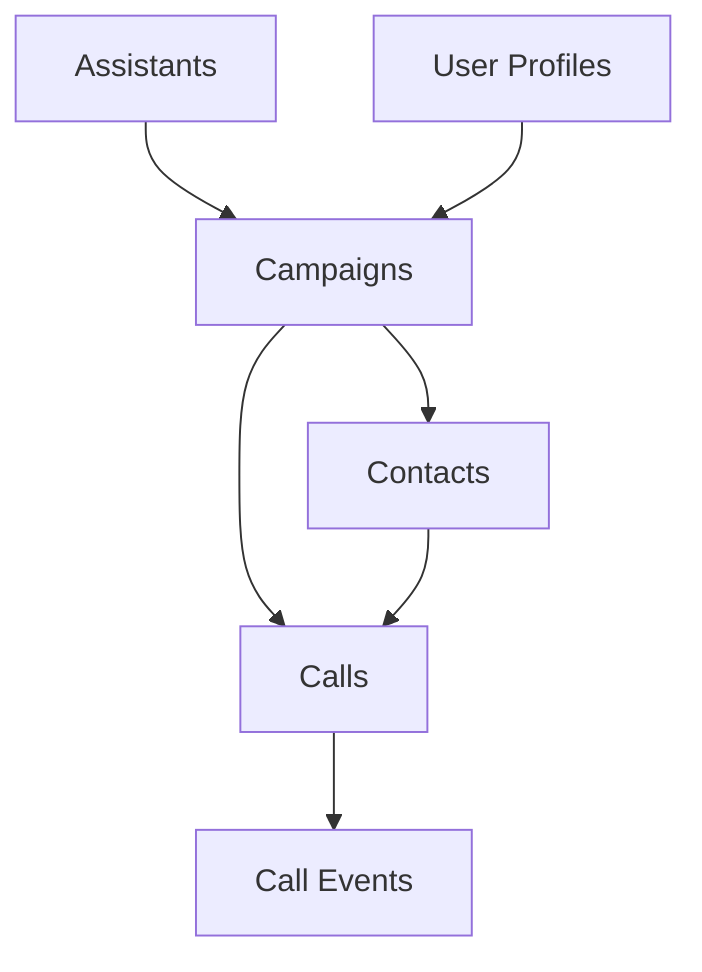
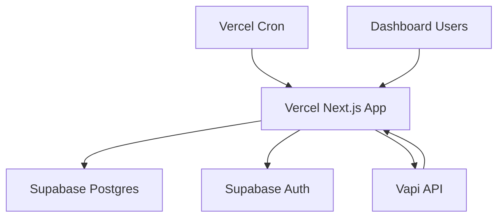

# AutoLynx PRD — API Specification

> **Version:** 1.0  
> **Related:** [Technical Requirements](./technical-requirements.md) | [Data Model](./data-model.md) | [Deployment](./deployment.md)

---

## Internal App Routes

### Assistant Management

#### `POST /api/assistants`
Create a new local assistant (calls Vapi, stores record).

**Request:**
```json
{
  "name": "string",
  "config": {
    "voice": "object",
    "firstMessage": "string",
    "systemPrompt": "string"
  }
}
```

**Response:**
```json
{
  "id": "uuid",
  "provider_assistant_id": "string",
  "name": "string",
  "config_json": "object",
  "active": true,
  "ephemeral": false
}
```

#### `POST /api/assistants/import`
Import existing assistant by provider ID.

**Request:**
```json
{
  "provider_assistant_id": "string",
  "name": "string"
}
```

#### `PATCH /api/assistants/:id`
Update assistant (may PATCH provider).

**Request:**
```json
{
  "name": "string?",
  "config": "object?",
  "active": "boolean?"
}
```

#### `DELETE /api/assistants/:id`
Delete assistant (only if unused by active campaigns).

**Response:** `204 No Content` or `409 Conflict`

### Campaign Management

#### `POST /api/campaigns`
Create campaign with CSV upload.

**Request:** `multipart/form-data`
- `file`: CSV file
- `assistantId`: UUID
- `phoneNumberId`: string
- `cap`: number (optional, default 8)
- `mode`: "continuous" | "batch" (optional, default "continuous")

**Response:**
```json
{
  "campaignId": "uuid",
  "importReport": {
    "accepted": 150,
    "skipped": [
      {
        "row": 23,
        "reason": "Invalid phone number"
      }
    ]
  }
}
```

#### `POST /api/campaigns/:id/start`
Start campaign (mark QUEUED).

**Request:**
```json
{
  "holdForConfirmation": false
}
```

**Response:**
```json
{
  "status": "QUEUED",
  "estimatedStartTime": "2024-01-01T12:00:00Z"
}
```

### Scheduling & Webhooks

#### `POST /api/scheduler/tick`
Cron entry point for campaign management.

**Request:**
```json
{
  "campaignId": "uuid?" // optional, processes all if omitted
}
```

**Headers:**
```
Authorization: Bearer <CRON_SHARED_SECRET>
```

#### `POST /api/webhooks/vapi`
Handle Vapi status updates.

**Request:**
```json
{
  "type": "call-status",
  "call": {
    "id": "provider_call_id",
    "status": "in-progress",
    "endedReason": "string?",
    "cost": 0.05,
    "recordingUrl": "string?",
    "transcript": "object?"
  }
}
```

**Headers:**
```
X-Signature: <webhook_signature>
```

### Data Retrieval

#### `GET /api/campaigns`
List campaigns with summary data.

**Response:**
```json
{
  "campaigns": [
    {
      "id": "uuid",
      "name": "string",
      "status": "RUNNING",
      "totalContacts": 200,
      "completedCalls": 45,
      "successfulCalls": 12,
      "createdAt": "2024-01-01T12:00:00Z"
    }
  ]
}
```

#### `GET /api/campaigns/:id/summary`
Campaign overview with metrics.

**Response:**
```json
{
  "id": "uuid",
  "name": "string",
  "status": "RUNNING",
  "assistant": {
    "id": "uuid",
    "name": "string"
  },
  "metrics": {
    "totalContacts": 200,
    "completedCalls": 45,
    "activeCalls": 3,
    "successfulCalls": 12,
    "totalCost": 15.75
  },
  "startedAt": "2024-01-01T12:00:00Z"
}
```

#### `GET /api/campaigns/:id/contacts`
Paginated contact list with call details.

**Query Parameters:**
- `page`: number (default 1)
- `limit`: number (default 50, max 500)
- `status`: filter by call status
- `search`: search by name/business/phone

**Response:**
```json
{
  "contacts": [
    {
      "id": "uuid",
      "name": "John Doe",
      "businessName": "Acme Corp",
      "phone": "+1234567890",
      "call": {
        "status": "ENDED",
        "endedReason": "customer-hangup",
        "cost": 0.05,
        "recordingUrl": "https://...",
        "duration": 45
      }
    }
  ],
  "pagination": {
    "page": 1,
    "limit": 50,
    "total": 200,
    "pages": 4
  }
}
```

#### `GET /api/campaigns/:id/export.csv`
Stream CSV export of campaign results.

**Response:** CSV stream with headers:
```
name,business_name,phone,status,ended_reason,cost,recording_url,transcript_json
```

## Error Responses

### Standard Error Format
```json
{
  "error": {
    "code": "VALIDATION_ERROR",
    "message": "Invalid phone number format",
    "details": {
      "field": "phone",
      "value": "invalid-phone"
    }
  }
}
```

### Common Error Codes
- `VALIDATION_ERROR` (400): Invalid input data
- `UNAUTHORIZED` (401): Missing or invalid auth
- `FORBIDDEN` (403): Insufficient permissions
- `NOT_FOUND` (404): Resource not found
- `CONFLICT` (409): Resource conflict (e.g., assistant in use)
- `RATE_LIMITED` (429): Too many requests
- `INTERNAL_ERROR` (500): Server error

## Authentication

All API routes require authentication except webhooks (which use signature verification).

**Headers:**
```
Authorization: Bearer <supabase_jwt_token>
```

## Rate Limiting

- **General API**: 100 requests/minute per user
- **Upload endpoints**: 10 requests/minute per user
- **Export endpoints**: 5 requests/minute per user

## Webhook Security

Vapi webhooks include signature verification:

**Verification:**
```javascript
const signature = req.headers['x-signature'];
const payload = req.body;
const expectedSignature = hmac('sha256', WEBHOOK_SECRET, payload);
// Compare signatures securely
```
```

```markdown:docs/prd/data-model.md
# AutoLynx PRD — Data Model

> **Version:** 1.0  
> **Related:** [Technical Requirements](./technical-requirements.md) | [API Spec](./api-spec.md)

---

## Core Tables

### Assistants
Persistent directory of Vapi assistants for campaign use.

```sql
CREATE TABLE assistants (
  id UUID PRIMARY KEY DEFAULT gen_random_uuid(),
  provider_assistant_id TEXT NOT NULL UNIQUE,
  name TEXT NOT NULL,
  source TEXT NOT NULL CHECK (source IN ('local', 'imported', 'template')),
  config_json JSONB NOT NULL,
  active BOOLEAN NOT NULL DEFAULT true,
  ephemeral BOOLEAN NOT NULL DEFAULT false,
  created_at TIMESTAMPTZ NOT NULL DEFAULT now(),
  updated_at TIMESTAMPTZ NOT NULL DEFAULT now()
);
```

**Key Constraints:**
- `provider_assistant_id` must be unique (maps to Vapi assistant ID)
- `ephemeral=false` for all Directory assistants (persistent)
- Cannot delete if referenced by active campaigns

### Campaigns
Campaign configuration and lifecycle management.

```sql
CREATE TABLE campaigns (
  id UUID PRIMARY KEY DEFAULT gen_random_uuid(),
  name TEXT NOT NULL,
  status TEXT NOT NULL DEFAULT 'CREATED' CHECK (
    status IN ('CREATED', 'QUEUED', 'DIALING', 'RUNNING', 'COMPLETED', 'PAUSED', 'FAILED')
  ),
  mode TEXT NOT NULL DEFAULT 'continuous' CHECK (mode IN ('continuous', 'batch')),
  cap INTEGER NOT NULL DEFAULT 8 CHECK (cap > 0),
  
  -- References
  assistant_id UUID NOT NULL REFERENCES assistants(id),
  phone_number_id TEXT NOT NULL,
  
  -- Lifecycle timestamps
  created_at TIMESTAMPTZ NOT NULL DEFAULT now(),
  started_at TIMESTAMPTZ,
  completed_at TIMESTAMPTZ,
  
  -- Metrics (derived but cached for performance)
  total_contacts INTEGER NOT NULL DEFAULT 0,
  total_cost_usd DECIMAL(10,4) DEFAULT 0,
  
  -- Configuration
  line_quiet_gating BOOLEAN NOT NULL DEFAULT false
);
```

**State Transitions:**
- `CREATED` → `QUEUED` (user starts campaign)
- `QUEUED` → `DIALING` (first successful call created)
- `DIALING` → `RUNNING` (calls in progress)
- `RUNNING` → `COMPLETED` (all calls terminal)

### Contacts
Individual contact records per campaign.

```sql
CREATE TABLE contacts (
  id UUID PRIMARY KEY DEFAULT gen_random_uuid(),
  campaign_id UUID NOT NULL REFERENCES campaigns(id) ON DELETE CASCADE,
  name TEXT NOT NULL,
  business_name TEXT,
  phone TEXT NOT NULL, -- E.164 format
  batch_index INTEGER, -- for batch mode grouping
  created_at TIMESTAMPTZ NOT NULL DEFAULT now(),
  
  UNIQUE(campaign_id, phone) -- prevent duplicates per campaign
);
```

**Indexing:**
- Primary access: `(campaign_id, id)` for pagination
- Deduplication: `(campaign_id, phone)` unique constraint
- Batch processing: `(campaign_id, batch_index)` for batching mode

### Calls
Individual call attempts with provider tracking.

```sql
CREATE TABLE calls (
  id UUID PRIMARY KEY DEFAULT gen_random_uuid(),
  campaign_id UUID NOT NULL REFERENCES campaigns(id),
  contact_id UUID NOT NULL REFERENCES contacts(id),
  
  -- Provider tracking
  provider_call_id TEXT UNIQUE, -- from Vapi
  status TEXT NOT NULL DEFAULT 'PENDING' CHECK (
    status IN ('PENDING', 'QUEUED', 'RINGING', 'IN_PROGRESS', 'ENDED', 'FAILED', 'CANCELED', 'TIMEOUT')
  ),
  
  -- Timing
  created_at TIMESTAMPTZ NOT NULL DEFAULT now(),
  started_at TIMESTAMPTZ, -- when call actually initiated
  ended_at TIMESTAMPTZ,
  
  -- Outcome data
  ended_reason TEXT,
  cost_usd DECIMAL(8,4),
  recording_url TEXT,
  transcript_json JSONB,
  
  -- Evaluation (future)
  success_evaluation JSONB
);
```

**Key Features:**
- `provider_call_id` nullable until call actually created with Vapi
- Status driven by webhook events
- Transcript stored as JSONB for queryability
- Cost tracking for spend monitoring

### Call Events (Audit Trail)
Immutable event log for complete call lifecycle tracking.

```sql
CREATE TABLE call_events (
  id UUID PRIMARY KEY DEFAULT gen_random_uuid(),
  call_id UUID NOT NULL REFERENCES calls(id),
  status TEXT NOT NULL,
  payload JSONB, -- full webhook payload or internal event data
  created_at TIMESTAMPTZ NOT NULL DEFAULT now()
);
```

**Purpose:**
- Immutable audit trail
- Webhook payload preservation
- Debugging and reconciliation
- Event sourcing for complex state reconstruction

## Supporting Tables

### User Management (Supabase Auth + Allowlist)

```sql
-- Extends Supabase auth.users
CREATE TABLE user_profiles (
  id UUID PRIMARY KEY REFERENCES auth.users(id),
  role TEXT NOT NULL DEFAULT 'operator' CHECK (role IN ('admin', 'operator')),
  allowlisted BOOLEAN NOT NULL DEFAULT false,
  created_at TIMESTAMPTZ NOT NULL DEFAULT now(),
  last_seen_at TIMESTAMPTZ
);
```

### Configuration & Metadata

```sql
CREATE TABLE system_config (
  key TEXT PRIMARY KEY,
  value JSONB NOT NULL,
  updated_at TIMESTAMPTZ NOT NULL DEFAULT now()
);

-- Example configs:
-- 'default_concurrency_cap' → 8
-- 'default_cron_cadence' → 60
-- 'vapi_phone_number_id' → "..."
```

## Indexes & Performance

### Critical Indexes
```sql
-- Campaign operations
CREATE INDEX idx_campaigns_status ON campaigns(status) WHERE status IN ('QUEUED', 'DIALING', 'RUNNING');

-- Contact pagination
CREATE INDEX idx_contacts_campaign_created ON contacts(campaign_id, created_at);

-- Call tracking
CREATE INDEX idx_calls_provider_id ON calls(provider_call_id) WHERE provider_call_id IS NOT NULL;
CREATE INDEX idx_calls_campaign_status ON calls(campaign_id, status);
CREATE INDEX idx_calls_active ON calls(campaign_id) WHERE status IN ('QUEUED', 'RINGING', 'IN_PROGRESS');

-- Event audit
CREATE INDEX idx_call_events_call_created ON call_events(call_id, created_at);
```

### Query Patterns
- **Active call count**: `SELECT COUNT(*) FROM calls WHERE campaign_id = ? AND status IN ('QUEUED', 'RINGING', 'IN_PROGRESS')`
- **Campaign progress**: `SELECT status, COUNT(*) FROM calls WHERE campaign_id = ? GROUP BY status`
- **Next batch contacts**: `SELECT * FROM contacts WHERE campaign_id = ? AND id NOT IN (SELECT contact_id FROM calls WHERE campaign_id = ?) LIMIT ?`

## Data Relationships



## Data Constraints & Rules

### Business Rules
- **Assistant deletion**: Only allowed if not referenced by campaigns with status IN ('QUEUED', 'DIALING', 'RUNNING')
- **Contact uniqueness**: One contact per phone number per campaign
- **Call creation**: Must have valid `contact_id` and `campaign_id`
- **Status transitions**: Enforced by application logic, audited in `call_events`

### Data Integrity
- All foreign keys have appropriate CASCADE/RESTRICT rules
- Phone numbers normalized to E.164 format before storage
- Costs stored as DECIMAL for precision
- Timestamps in UTC (TIMESTAMPTZ)

### Privacy & Retention
- PII limited to contact names and phone numbers (business requirement)
- Transcript data encrypted at rest (Supabase default)
- Configurable retention policies for completed campaigns
- No sensitive data in logs (application responsibility)
```

```markdown:docs/prd/deployment.md
# AutoLynx PRD — Deployment & Operations

> **Version:** 1.0  
> **Related:** [Overview](./overview.md) | [Technical Requirements](./technical-requirements.md) | [API Spec](./api-spec.md)

---

## Architecture Overview

**Next.js on Vercel** (App Router) + **Supabase** + **Vapi Integration**



## Hosting & Infrastructure

### Vercel Platform
- **Next.js App Router**: UI + API routes
- **Serverless Functions**: automatic scaling
- **Edge Runtime**: optimal performance
- **Cron Jobs**: scheduled campaign management

### Supabase Backend
- **Postgres Database**: primary data store
- **Authentication**: built-in auth with allowlist
- **Real-time**: WebSocket subscriptions for live updates
- **Row Level Security**: data access control

### External Services
- **Vapi**: voice AI provider for outbound calls
- **Webhooks**: real-time call status updates

## Environment Configuration

### Required Environment Variables

```bash
# Supabase Configuration
SUPABASE_URL=https://your-project.supabase.co
SUPABASE_SERVICE_ROLE_KEY=eyJ... # server-side operations
SUPABASE_ANON_KEY=eyJ... # client-side auth

# Vapi Integration
VAPI_API_KEY=your-vapi-api-key
VAPI_PHONE_NUMBER_ID=your-phone-number-id

# Security
WEBHOOK_SHARED_SECRET=random-secure-string
CRON_SHARED_SECRET=random-secure-string

# Optional Configuration
DEFAULT_CONCURRENCY_CAP=8
DEFAULT_CRON_CADENCE=60
```

### Security Requirements
- **Secrets**: All sensitive data server-side only
- **API Keys**: Stored in Vercel environment variables
- **Database Access**: Service role key for server routes only
- **Webhook Verification**: HMAC signature validation

## Deployment Environments

### Development Environment
- **Vercel Preview**: automatic deployment on PR
- **Supabase Project**: separate dev database
- **Vapi Test Account**: sandbox for development
- **Local Development**: Next.js dev server with environment file

### Production Environment
- **Vercel Production**: main branch auto-deploy
- **Supabase Production**: dedicated project with backups
- **Vapi Production**: live phone number and billing
- **Monitoring**: error tracking and performance monitoring

## Database Schema Deployment

### Migration Strategy
```sql
-- Enable required extensions
CREATE EXTENSION IF NOT EXISTS "uuid-ossp";

-- Create tables (see data-model.md for complete DDL)
-- Apply indexes for performance
-- Set up RLS policies for security
```

### Initial Data Setup
```sql
-- Create admin user profile
INSERT INTO user_profiles (id, role, allowlisted) 
VALUES ('admin-uuid', 'admin', true);

-- Configure system defaults
INSERT INTO system_config (key, value) VALUES
  ('default_concurrency_cap', '8'),
  ('default_cron_cadence', '60'),
  ('vapi_phone_number_id', 'your-phone-number-id');
```

## Cron Job Configuration

### Vercel Cron Setup
```javascript
// vercel.json
{
  "crons": [
    {
      "path": "/api/scheduler/tick",
      "schedule": "*/1 * * * *" // Every minute
    }
  ]
}
```

### Scheduler Implementation
```typescript
// app/api/scheduler/tick/route.ts
export async function POST(request: Request) {
  // Verify cron secret
  const auth = request.headers.get('authorization');
  if (auth !== `Bearer ${process.env.CRON_SHARED_SECRET}`) {
    return new Response('Unauthorized', { status: 401 });
  }
  
  // Process active campaigns
  await processCampaigns();
  
  return new Response('OK');
}
```

## Monitoring & Observability

### Application Monitoring
- **Vercel Analytics**: performance and usage metrics
- **Error Tracking**: structured error logging
- **Custom Metrics**: campaign success rates, call volumes
- **Health Checks**: automated endpoint monitoring

### Database Monitoring
- **Supabase Dashboard**: query performance and connections
- **Connection Pooling**: efficient resource usage
- **Query Optimization**: indexed access patterns
- **Backup Verification**: automated backup testing

### Third-Party Monitoring
- **Vapi Webhook Health**: webhook delivery success rates
- **Rate Limit Tracking**: API usage against limits
- **Cost Monitoring**: spend tracking and alerts

## Security Considerations

### Authentication & Authorization
- **Supabase Auth**: JWT-based authentication
- **Allowlist Control**: user access management
- **Role-Based Access**: Admin vs Operator permissions
- **Session Management**: secure token handling

### Data Protection
- **Encryption at Rest**: Supabase default encryption
- **Encryption in Transit**: HTTPS/TLS everywhere
- **PII Minimization**: limited personal data storage
- **Log Sanitization**: no sensitive data in logs

### API Security
- **Webhook Verification**: HMAC signature validation
- **Rate Limiting**: prevent abuse and respect limits
- **Input Validation**: comprehensive request validation
- **SQL Injection Prevention**: parameterized queries

## Disaster Recovery

### Backup Strategy
- **Supabase Backups**: automatic daily backups
- **Configuration Backup**: environment variables documented
- **Code Repository**: version control with Git
- **Documentation**: comprehensive setup instructions

### Recovery Procedures
1. **Database Restore**: Supabase point-in-time recovery
2. **Application Redeploy**: Vercel deployment from Git
3. **Configuration Restore**: environment variable setup
4. **Service Verification**: end-to-end functionality testing

### Business Continuity
- **Campaign State Recovery**: resume from last known state
- **Call Reconciliation**: webhook-based truth reconstruction
- **User Communication**: status page and notifications
- **Fallback Procedures**: manual campaign management if needed

## Performance Optimization

### Application Performance
- **Static Generation**: pre-built pages where possible
- **API Route Optimization**: efficient database queries
- **Caching Strategy**: appropriate cache headers
- **Bundle Optimization**: minimal JavaScript payloads

### Database Performance
- **Query Optimization**: proper indexing strategy
- **Connection Pooling**: efficient resource usage
- **Query Caching**: repeated query optimization
- **Data Archiving**: old campaign cleanup

### Third-Party Integration
- **Rate Limit Respect**: avoid 429 errors
- **Retry Logic**: exponential backoff for failures
- **Webhook Processing**: efficient event handling
- **Concurrent Call Management**: respect provider limits

## Scaling Considerations

### Current Limitations
- **Concurrent Calls**: default cap of 8 (Vapi free plan)
- **Database Connections**: Supabase plan limits
- **Serverless Functions**: Vercel execution limits
- **Storage**: Supabase database size limits

### Future Scaling
- **Horizontal Database Scaling**: read replicas for analytics
- **CDN Integration**: static asset optimization
- **Database Sharding**: multi-tenant data separation
- **Microservice Migration**: service extraction if needed

## Cost Management

### Current Cost Structure
- **Vercel**: free tier for development, pro for production
- **Supabase**: free tier adequate for initial usage
- **Vapi**: pay-per-call pricing model
- **Monitoring**: included in platform costs

### Cost Optimization
- **Efficient Queries**: minimize database usage
- **Caching**: reduce redundant computations
- **Resource Monitoring**: track usage patterns
- **Spend Alerts**: automated cost threshold notifications
```

Now let me create an index file that ties all the sharded documents together:

```markdown:docs/prd/README.md
# AutoLynx PRD — Sharded Documentation

> **Product Requirements Document v1.0**  
> **CSV-driven Outbound Calling System**

This PRD has been broken down into focused documents for better maintainability and navigation.

## Document Structure

### 📋 [Overview](./overview.md)
**Core vision, success criteria, and scope definition**
- Purpose & vision statement
- Success criteria and key metrics
- In-scope vs out-of-scope features
- User personas and key decisions

### 🔄 [User Flows](./user-flows.md)
**End-to-end workflows and user stories**
- CSV import and campaign creation
- Campaign start and monitoring flows
- Concurrency management modes
- State transitions and edge cases

### ⚙️ [Technical Requirements](./technical-requirements.md)
**Functional and non-functional requirements**
- Authentication and authorization
- CSV processing and validation
- Assistant directory management
- Performance and reliability targets

### 🔌 [API Specification](./api-spec.md)
**Complete API interface documentation**
- Internal app routes and endpoints
- Request/response schemas
- Authentication and security
- Error handling and rate limiting

### 🗄️ [Data Model](./data-model.md)
**Database schema and relationships**
- Core tables and constraints
- Indexes and performance considerations
- Data integrity and business rules
- Privacy and retention policies

### 🚀 [Deployment](./deployment.md)
**Infrastructure and operations**
- Architecture overview
- Environment configuration
- Monitoring and observability
- Security and disaster recovery

## Quick Navigation

### By Role
- **👤 Product Manager**: Start with [Overview](./overview.md) → [User Flows](./user-flows.md)
- **💻 Developer**: Focus on [Technical Requirements](./technical-requirements.md) → [API Spec](./api-spec.md) → [Data Model](./data-model.md)
- **🔧 DevOps**: Review [Deployment](./deployment.md) and security considerations
- **📊 Analyst**: Examine [Data Model](./data-model.md) and metrics in [Technical Requirements](./technical-requirements.md)

### By Development Phase
1. **Planning**: [Overview](./overview.md) + [User Flows](./user-flows.md)
2. **Architecture**: [Technical Requirements](./technical-requirements.md) + [Data Model](./data-model.md)
3. **Implementation**: [API Spec](./api-spec.md) + [Technical Requirements](./technical-requirements.md)
4. **Deployment**: [Deployment](./deployment.md)

## Key Decisions (Locked)
- **Default concurrency cap**: 8 calls
- **Cron cadence**: 60s ± jitter
- **Truth source**: Webhook-driven call status
- **Assistant model**: Persistent directory (no auto-deletes)
- **Transcript storage**: Inline JSONB in database

## Related Documents
- **Architecture Document**: `../architecture.md` (implementation details)
- **Original PRD**: `../prd.md` (consolidated version)

---

*This sharded structure enables parallel work across teams while maintaining consistency with the overall product vision.*
```

I've successfully sharded the AutoLynx PRD into 6 focused documents within a `docs/prd/` directory structure:

## Sharded Documents Created:

1. **📋 `overview.md`** - Core vision, success criteria, scope, and key decisions
2. **🔄 `user-flows.md`** - End-to-end workflows, user stories, and state transitions  
3. **⚙️ `technical-requirements.md`** - Functional/non-functional requirements and integration specs
4. **🔌 `api-spec.md`** - Complete API documentation with endpoints and schemas
5. **🗄️ `data-model.md`** - Database schema, relationships, and performance considerations
6. **🚀 `deployment.md`** - Infrastructure, operations, security, and scaling
7. **📖 `README.md`** - Navigation index and quick reference guide

## Benefits of This Sharded Structure:

- **🎯 Focused Documents**: Each file addresses specific concerns without overwhelming detail
- **👥 Team Specialization**: Different roles can focus on relevant sections
- **🔄 Parallel Development**: Teams can work on different aspects simultaneously  
- **📱 Better Navigation**: Quick access to specific information without scrolling through 171 lines
- **🔍 Improved Searchability**: Targeted content makes finding information faster
- **📝 Easier Maintenance**: Updates can be made to specific areas without affecting others

The sharded structure maintains all the original content while organizing it into logical, consumable chunks that align with different development phases and team responsibilities. 