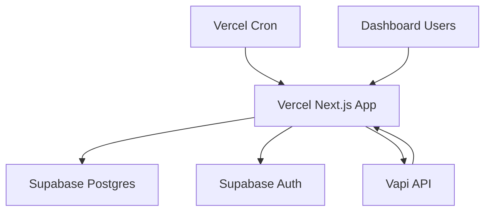

# AutoLynx PRD — Deployment & Operations

> **Version:** 1.0  
> **Related:** [Overview](./overview.md) | [Technical Requirements](./technical-requirements.md) | [API Spec](./api-spec.md)

---

## Architecture Overview

**Next.js on Vercel** (App Router) + **Supabase** + **Vapi Integration**



## Hosting & Infrastructure

### Vercel Platform
- **Next.js App Router**: UI + API routes
- **Serverless Functions**: automatic scaling
- **Edge Runtime**: optimal performance
- **Cron Jobs**: scheduled campaign management

### Supabase Backend
- **Postgres Database**: primary data store
- **Authentication**: built-in auth with allowlist
- **Real-time**: WebSocket subscriptions for live updates
- **Row Level Security**: data access control

### External Services
- **Vapi**: voice AI provider for outbound calls
- **Webhooks**: real-time call status updates

## Environment Configuration

### Required Environment Variables

```bash
# Supabase Configuration
SUPABASE_URL=https://your-project.supabase.co
SUPABASE_SERVICE_ROLE_KEY=eyJ... # server-side operations
SUPABASE_ANON_KEY=eyJ... # client-side auth

# Vapi Integration
VAPI_API_KEY=your-vapi-api-key
VAPI_PHONE_NUMBER_ID=your-phone-number-id

# Security
WEBHOOK_SHARED_SECRET=random-secure-string
CRON_SHARED_SECRET=random-secure-string

# Optional Configuration
DEFAULT_CONCURRENCY_CAP=8
DEFAULT_CRON_CADENCE=60
```

### Security Requirements
- **Secrets**: All sensitive data server-side only
- **API Keys**: Stored in Vercel environment variables
- **Database Access**: Service role key for server routes only
- **Webhook Verification**: HMAC signature validation

## Deployment Environments

### Development Environment
- **Vercel Preview**: automatic deployment on PR
- **Supabase Project**: separate dev database
- **Vapi Test Account**: sandbox for development
- **Local Development**: Next.js dev server with environment file

### Production Environment
- **Vercel Production**: main branch auto-deploy
- **Supabase Production**: dedicated project with backups
- **Vapi Production**: live phone number and billing
- **Monitoring**: error tracking and performance monitoring

## Database Schema Deployment

### Migration Strategy
```sql
-- Enable required extensions
CREATE EXTENSION IF NOT EXISTS "uuid-ossp";

-- Create tables (see data-model.md for complete DDL)
-- Apply indexes for performance
-- Set up RLS policies for security
```

### Initial Data Setup
```sql
-- Create admin user profile
INSERT INTO user_profiles (id, role, allowlisted) 
VALUES ('admin-uuid', 'admin', true);

-- Configure system defaults
INSERT INTO system_config (key, value) VALUES
  ('default_concurrency_cap', '8'),
  ('default_cron_cadence', '60'),
  ('vapi_phone_number_id', 'your-phone-number-id');
```

## Cron Job Configuration

### Vercel Cron Setup
```javascript
// vercel.json
{
  "crons": [
    {
      "path": "/api/scheduler/tick",
      "schedule": "*/1 * * * *" // Every minute
    }
  ]
}
```

### Scheduler Implementation
```typescript
// app/api/scheduler/tick/route.ts
export async function POST(request: Request) {
  // Verify cron secret
  const auth = request.headers.get('authorization');
  if (auth !== `Bearer ${process.env.CRON_SHARED_SECRET}`) {
    return new Response('Unauthorized', { status: 401 });
  }
  
  // Process active campaigns
  await processCampaigns();
  
  return new Response('OK');
}
```

## Monitoring & Observability

### Application Monitoring
- **Vercel Analytics**: performance and usage metrics
- **Error Tracking**: structured error logging
- **Custom Metrics**: campaign success rates, call volumes
- **Health Checks**: automated endpoint monitoring

### Database Monitoring
- **Supabase Dashboard**: query performance and connections
- **Connection Pooling**: efficient resource usage
- **Query Optimization**: indexed access patterns
- **Backup Verification**: automated backup testing

### Third-Party Monitoring
- **Vapi Webhook Health**: webhook delivery success rates
- **Rate Limit Tracking**: API usage against limits
- **Cost Monitoring**: spend tracking and alerts

## Security Considerations

### Authentication & Authorization
- **Supabase Auth**: JWT-based authentication
- **Allowlist Control**: user access management
- **Role-Based Access**: Admin vs Operator permissions
- **Session Management**: secure token handling

### Data Protection
- **Encryption at Rest**: Supabase default encryption
- **Encryption in Transit**: HTTPS/TLS everywhere
- **PII Minimization**: limited personal data storage
- **Log Sanitization**: no sensitive data in logs

### API Security
- **Webhook Verification**: HMAC signature validation
- **Rate Limiting**: prevent abuse and respect limits
- **Input Validation**: comprehensive request validation
- **SQL Injection Prevention**: parameterized queries

## Disaster Recovery

### Backup Strategy
- **Supabase Backups**: automatic daily backups
- **Configuration Backup**: environment variables documented
- **Code Repository**: version control with Git
- **Documentation**: comprehensive setup instructions

### Recovery Procedures
1. **Database Restore**: Supabase point-in-time recovery
2. **Application Redeploy**: Vercel deployment from Git
3. **Configuration Restore**: environment variable setup
4. **Service Verification**: end-to-end functionality testing

### Business Continuity
- **Campaign State Recovery**: resume from last known state
- **Call Reconciliation**: webhook-based truth reconstruction
- **User Communication**: status page and notifications
- **Fallback Procedures**: manual campaign management if needed

## Performance Optimization

### Application Performance
- **Static Generation**: pre-built pages where possible
- **API Route Optimization**: efficient database queries
- **Caching Strategy**: appropriate cache headers
- **Bundle Optimization**: minimal JavaScript payloads

### Database Performance
- **Query Optimization**: proper indexing strategy
- **Connection Pooling**: efficient resource usage
- **Query Caching**: repeated query optimization
- **Data Archiving**: old campaign cleanup

### Third-Party Integration
- **Rate Limit Respect**: avoid 429 errors
- **Retry Logic**: exponential backoff for failures
- **Webhook Processing**: efficient event handling
- **Concurrent Call Management**: respect provider limits

## Scaling Considerations

### Current Limitations
- **Concurrent Calls**: default cap of 8 (Vapi free plan)
- **Database Connections**: Supabase plan limits
- **Serverless Functions**: Vercel execution limits
- **Storage**: Supabase database size limits

### Future Scaling
- **Horizontal Database Scaling**: read replicas for analytics
- **CDN Integration**: static asset optimization
- **Database Sharding**: multi-tenant data separation
- **Microservice Migration**: service extraction if needed

## Cost Management

### Current Cost Structure
- **Vercel**: free tier for development, pro for production
- **Supabase**: free tier adequate for initial usage
- **Vapi**: pay-per-call pricing model
- **Monitoring**: included in platform costs

### Cost Optimization
- **Efficient Queries**: minimize database usage
- **Caching**: reduce redundant computations
- **Resource Monitoring**: track usage patterns
- **Spend Alerts**: automated cost threshold notifications 